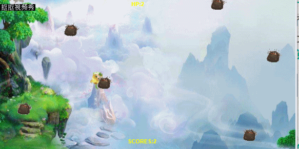

# 用Construct 2制作简单躲避游戏

## 教程概况

#### 难度：初学者

#### 平台：Construct 2

Construct 2 平台是一款零基础制作游戏的软件。下面让我们来一起制作简单的躲避游戏，体验一下使用Construct 2 平台的乐趣。

## 准备工作

安装好Construct 2平台了吗？如果还没有，那还等什么，快去[官方安装平台](https://www.scirra.com/construct2)下载吧！别忘了在游戏制作之前准备好需要的素材，例如图片等等。

## 开始一个新的项目

启动Construct 2 ,点击左上角File按钮，然后点击NEW.

你将看到一个对话框，现在，选择第一个选项，点击Open，开始一个新的项目。现在，你将看到一个新布局。

## 插入对象

### 插入平铺背景

双击布局中的空白处或单击右键，选择“插入对象”以插入新对象。出现对话框后，双击“平铺背景”将其插入。

这时将出现一个十字准线，指示放置对象的位置。单击布局中间附近的某个位置。在纹理编辑器会立即打开。让我们导入你之前保存的图块图像。单击文件夹图标，找到将文件下载到的位置，然后选择它。

单击右上角的X关闭纹理编辑器。如果系统提示您，请务必保存！

现在，您应该在布局中看到平铺的背景对象。让我们调整它以覆盖整个布局。确保选中它，然后左侧的属性栏应显示对象的所有设置，包括其大小和位置。将其位置设置为0,0（布局的左上角），并将其大小设置为1280,1024（布局的大小）。

如果你的背景图片不是单一重复的，可以将它的大小调整为覆盖虚线位置，这样更加美观。

你可以缩放背景以进行后续操作。命中控制+ 0或单击视图 - 缩放至100％以返回1：1视图。

### 添加图层

单击“项目”栏旁边的图层选项，将已有的“第0层”重命名为“Background”.

点击+添加“第1层”并命名为Main，添加“第2层”并命名为HUD。

现在图层栏应该是这样的：

确保选中了Main使所有新对象插入这一活动图层。

### 添加输入对象

双击布局插入Mouse对象，我们需要鼠标来操作游戏。

这一对象在游戏中是隐藏的。

### 添加游戏对象

重复“添加图层”时的操作，这一次选择“Sprite”。确保系统提示为主图层。

调整游戏对象的大小。这时，你将看到以下画面。

在右侧操作栏中修改游戏对象的名字为以下：

## 添加行为与事件

### 添加行为

点击左侧栏中的行为添加，点击+并选择需要的行为。游戏对象将按照这些行为行动。

具体行为功能请自行阅读添加行为栏中的介绍。

调整玩家与怪兽的Bullet速度为200和250。如下：

现在行为栏应该是这样的：

### 添加事件

单击顶部的“事件表”以切换到事件表编辑器。事件表顶部的事件将首先运行。

双击事件表中的空白处，添加新事件。首先，选中系统图标,它表示Construct 2的内置功能。

现在，将出现条件列表。

选择条件Every tick，即每一时刻。关闭列表，你将看到：

现在，添加更多事件：

## 制作分数列表与抬头显示器

首先，在事件列表空白处点击右键以插入Global number,分别输入HP=3,SCORE=0。这将是生命和分数的初始值。

选择HUD图层,插入新对象，选择Text。

将Text栏移动至如图。

在左侧下方改变字的颜色和大小。

插入第三个Text并将其定义为Invisible。根据事件表内容，这意味着它将在游戏结束时出现并显示分数。

## 最后的润色

为了使游戏不轻易结束，我们让系统每0.3秒制造一个怪物。

添加事件如下：

为了让游戏失败后能重新启动，我们添加一个按钮并设置初始状态为Invisible.

## 现在，点击左上角的运行键，让我们一起玩游戏吧！

