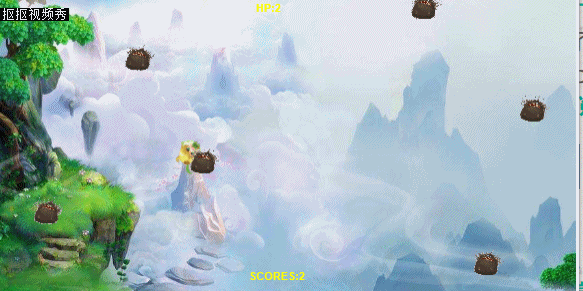

# HTML5游戏设计与制作

## 一、游戏策划

1、创作动机：为广大人民群众提供消遣娱乐的方式

2、目标市场：小学生

3、游戏背景：很久很久以前，一群可爱的小精灵无忧无虑地生活在魔法森林中。突然有一天，森林边缘出现了一个黑色的洞口，涌出许多怪物，于是小精灵们开始了逃亡。

4、游戏玩法：玩家躲避怪物，每成功躲避一秒加一分，游戏时间无上限。玩家与怪物触碰累计三次则游戏失败。

5、人设与道具：

(1)Player:小精灵。有三个生命值，被怪物第三次触碰时死亡。可360度自由移动。

(2)Monster:怪物。随机生成并掉落，可杀死小精灵。

## 二、游戏设计

1、

Object:小精灵  

Attribute:图片，位置 

Collaborator:怪物  Events & Actions:碰撞 & HP减一

Collaborator:系统  Events & Actions:HP<=0 & 销毁自己

2、 

Object:怪物    

Attribute:图片，位置   

Collaborator:小精灵 Events & Actions:碰撞 & 销毁小精灵

Collaborator:界面 Events & Actions:离开界面 & 销毁自己

